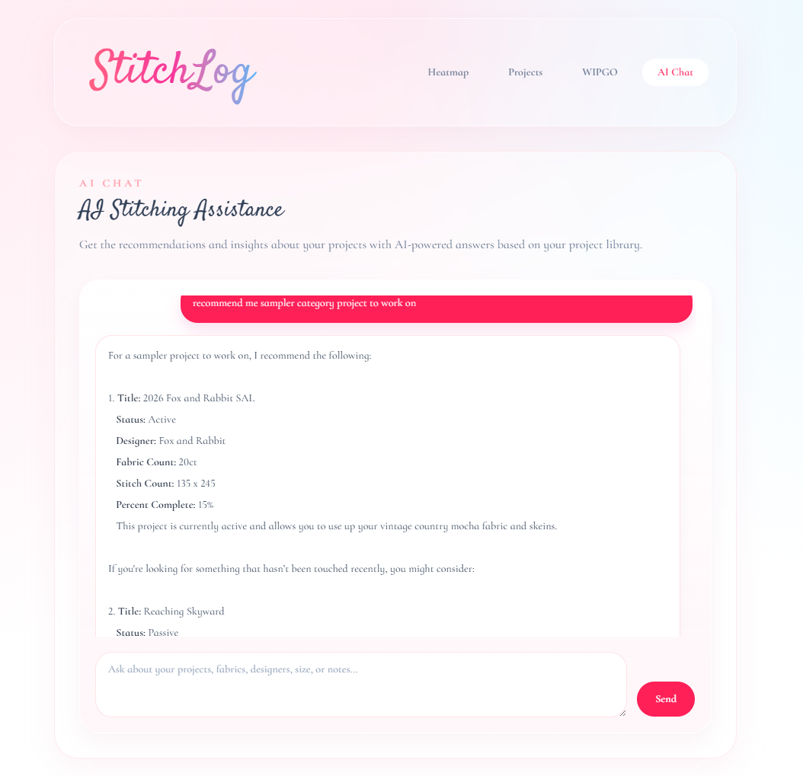
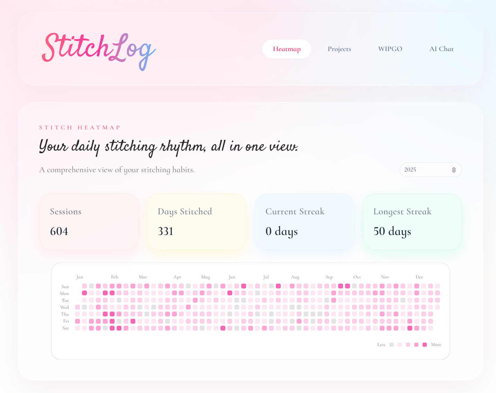
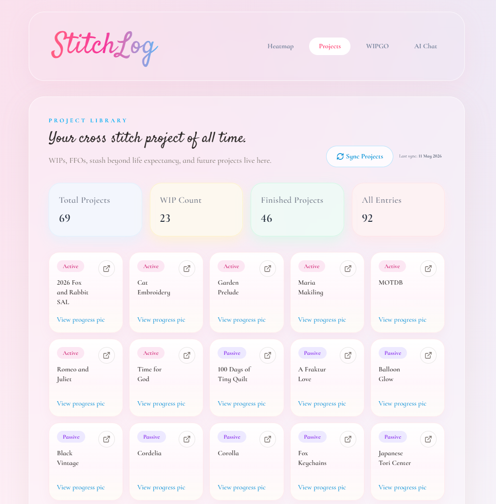

# StitchLog

StitchLog is a personal cross-stitch dashboard built as a small full-stack app. It pulls stitching data from Notion, caches and reshapes it in MongoDB, and presents it through a React dashboard with an optional AI assistant for project discovery and recommendations.

## Screenshots





## What the app currently does

- Shows a yearly stitch heatmap with session counts, stitched days, and streak stats.
- Syncs heatmap entries from a Notion data source into MongoDB.
- Shows a Projects shelf sourced from Notion, including statuses and progress picture links.
- Shows a WIPGO board by combining WIPGO entries with linked project records.
- Provides an AI chat page backed by OpenAI embeddings plus MongoDB vector search over indexed project data.

## Repo structure

- `client/`: Vite + React 19 frontend.
- `server/`: Express 5 + TypeScript API, Notion sync logic, MongoDB access, and AI/RAG services.

## Architecture at a glance

1. The frontend calls `/api/...` endpoints through the Vite dev proxy.
2. The server syncs Notion pages into MongoDB collections such as `stitch_entries`, `projects`, and `wipgo`.
3. Project records can include normalized metadata, extracted page notes, and progress picture URLs.
4. After syncing projects, the server reindexes a separate RAG collection with OpenAI embeddings.
5. The AI chat route first tries metadata-aware filtering, then falls back to MongoDB vector search.

## Key architecture decisions

- Notion is treated as the source of truth; MongoDB is the app cache and query layer.
- Sync endpoints explicitly persist normalized documents instead of querying Notion directly from the UI.
- The project RAG index is separate from the raw `projects` collection, which keeps AI search concerns isolated from sync concerns.
- Client-side navigation uses hash routing, which keeps the app simple without requiring server-side SPA route handling.
- The frontend keeps business logic in small utility and service modules, while pages mostly orchestrate fetching and presentation.

## Local development

Run the server and client in separate terminals.

### Server

```powershell
cd server
copy .env.example .env
npm install
npm run dev
```

### Client

```powershell
cd client
npm install
npm run dev
```

The client expects the API at `http://localhost:4000` during local development and proxies `/api` requests there.

## Environment and integrations

The server expects configuration for:

- Notion access tokens and database/data source IDs
- MongoDB connection details
- OpenAI API key and model names
- MongoDB collection/index names for the project RAG store

## Things worth noting

- Syncing the home heatmap is year-specific.
- Syncing projects also triggers RAG reindexing for AI chat.
- WIPGO depends on both the `wipgo` collection and project relation IDs lining up correctly.
